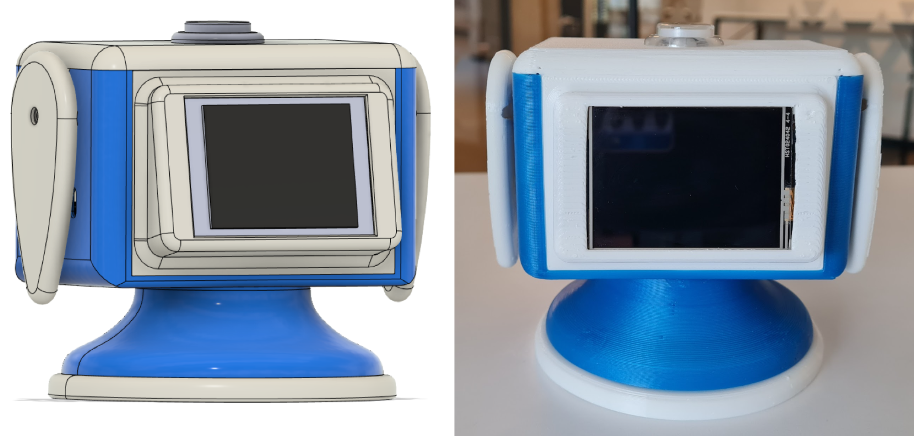

# Robotic Study Companion (RSC)
A robotic study companion (RSC) is a type of social robot designed to interact with [university] students in a human-centric way and to operate in academic environments alongside them. RSCs can take on various forms, from humanoid to animal-like or even abstract, but they all share the goal of engaging students in an interpersonal manner. This involves communicating and coordinating their behaviour with students through various modalities, such as verbal, nonverbal, or affective means, with the aim of providing personalised support, feedback, and motivation for students to enhance their academic performance and learning outcomes.  
~_Farnaz Baksh, 2023_

**Youtube playlist of [RSC demos](https://youtube.com/playlist?list=PL49qLAAzGgOxQGmKcBarU2cArTEF4M34z)**

Informal [RSC Survey](https://forms.gle/rxxPeKKdKfdqFwnz9)

## Design & Development
The RSC prototype is constructed using off-the-shelf components and utilised OpenAI's conversational API, which has proven its ability to simplify complex concepts and facilitate interactive conversations. The RSC features a portable, friendly hourglass shape design, standing at 11cm tall and weighing ~374g. 

To provide a comprehensive user experience, the RSC enables interaction through various modalities such as voice, gesture, tactile inputs, and incorporates visual, auditory, and motion indicators for enhanced expressiveness. It strikes a balance between cost and technical performance, making it affordable for educational institutions and students. 
With its sleek design and friendly appearance, the RSC can serve as an inviting and approachable study companion, offering academic support to students on their learning journey.

### Hardware 
* RaspberryPi 4 Model B 4GB RAM + 32 GB SD Card
* AIY Voice Bonnet version2 (microphone + speaker + LED Button)
* Neopixel Ring 16 x 5050 RGB LED
* SG90 Servo Motors (Qty: 2)
*  Nextion Enhanced NX3224T024 - Generic 2.4'' HMI 320*240 Touch Display
*  Logic Level Shifter 4-Channel, Bidirectional

### Software
##### Raspbian GNU/Linux / AIY system image  

Current Libraries + Dependencies:
* AIY API library
* SpeechRecognition library version 3.9.0 
* pyttsx3 library version 2.90
* OpenAI Python Library version 0.27.4
* adafruit-circuitpython-neopixel library version 6.3.8

### To Do
- [ ]  try whisper or azure for natural voice
- [ ] create and implement touch display menu
- [ ] expand behavioural states

### Open Source License  
The Creative Commons Attribution-NonCommercial (CC BY-NC) license is an open source license that allows others to use, distribute, and modify this project for non-commercial purposes, as long as they give credit to the original author. 

##### Resources:
xxx
